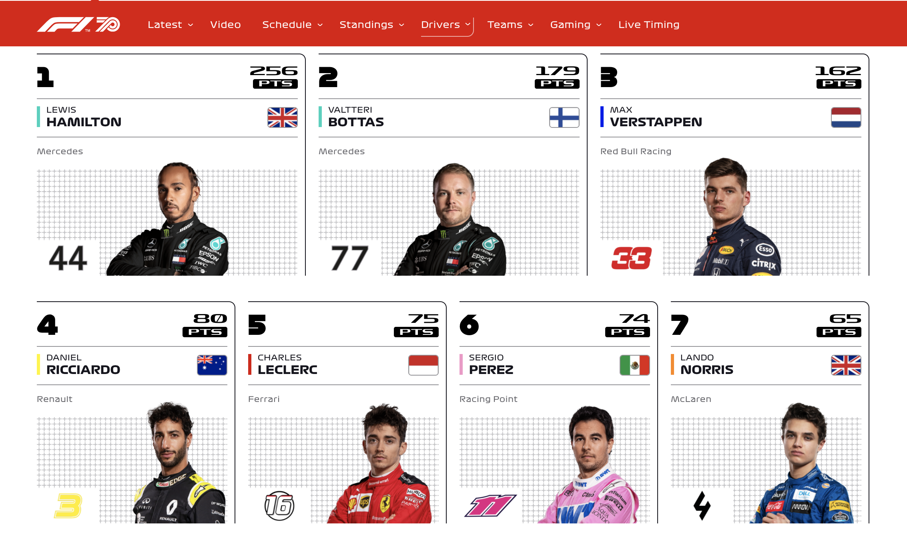

# Formula 1, NYT, and More

## Formula One Factory Function



Write a factory function `FormulaOne` inside of `formula-1.js` that takes in 3 parameters `(player, team, country)` 
and make an instance of every driver in the array of drivers inside of `formula-1.js`. Hint: Iterators 🏎

## New York Times API


- Register and sign up for an API key for the New York Times API { [here](https://developer.nytimes.com) }. In order to use their API (GET data), you will need a key. 
- Once you are able to get the API, save that as a string in side of `credentials.js`
```js
const API_KEY = 'apikeygoeshere';
```
- Next, try to `console.log` the `credentials` variable inside of the `nyt.js` file.
- Once you are able to print that to the console. You can now use that inside of the `nyt.js` file. 😎
- Once you fetch the data, try using `async/await` to see if you can replace the `.then` syntax.

## Class & Promise
- Practicing using the above 2 problems make a `class` and make a few instances inside of the `other.js` file
- Practicing make a Promise inside `other.js` with the above two problems in a creative way and make sure that it is working